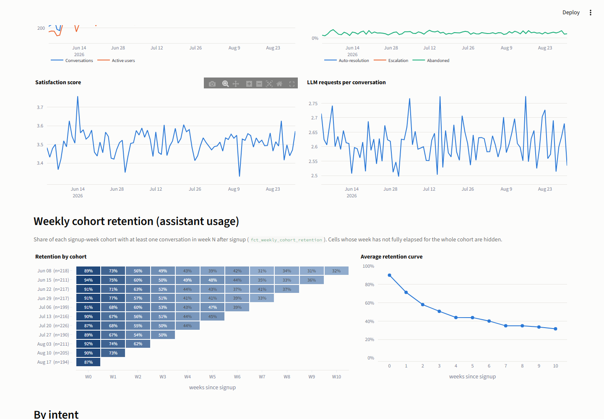
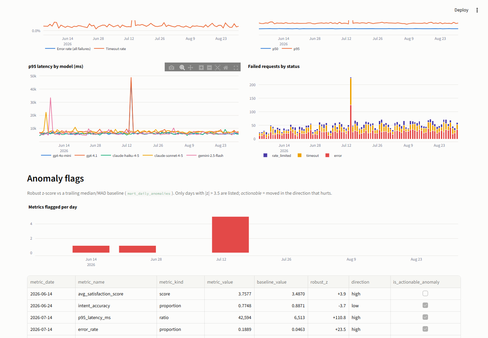

# LLM Product Analytics Warehouse

[](https://github.com/advien/llm-product-analytics-warehouse/actions/workflows/dbt-build.yml)

A production-style analytics warehouse for an LLM assistant product: raw
conversation, LLM-request, cost, latency, intent-quality and escalation events
modelled with **dbt + DuckDB** into tested marts and a dashboard.

The point is not the dashboard. The point is that every number on it can be
traced to one documented SQL expression, survives 170 dbt tests, and is
reconciled across marts — on raw data that is deliberately broken in the ways
real product event streams are broken.


## Business context

The simulated product is an LLM-powered support assistant for a consumer
fintech app. Users open a conversation (mobile app / web / WhatsApp), an intent
classifier routes it, the assistant makes one or more LLM calls across several
providers, and the conversation either resolves, escalates to a human team, or
is abandoned. The questions the warehouse answers are the ones an AI product
team actually gets asked:

- Are we deflecting tickets? *Auto-resolution vs escalation rate, by intent.*
- What does a resolved conversation cost, and is the cost we log even right?
  *Cost per conversation, recomputed from tokens × price list, reconciled
  against the logged value.*
- Which model/provider is failing or slow? *Error breakdown and latency
  percentiles per model per day; a provider incident is in the data.*
- Is the intent classifier good enough to trust routing to it? *Accuracy on
  the human-reviewed subset, corrected-intent rate, confidence distribution,
  confusion matrix.*

All data is synthetic and generated by a seeded script. No real users, no
scraped data.

## Architecture

```
generate_synthetic_data.py ─► data/raw/*.csv ─► load_duckdb.py ─► raw.*
                                                                    │ dbt build
                                            staging.*  ─► intermediate.* ─► marts.*
                                                                              │
                                                              Streamlit dashboard (marts only)
```

| Layer | Models | What happens |
|---|---|---|
| **sources** | 6 raw tables | Loaded verbatim (all VARCHAR). Freshness declared. Tests at `warn` severity document known upstream defects. |
| **staging** | 6 | Cast, rename, dedupe, **flag** every defect (never drop). Tests at `error` severity prove the fix. |
| **intermediate** | 5 | Cost recomputation + reconciliation, conversation rollups, quality signals, additive daily components, confusion matrix. |
| **marts** | 11 | `fct_conversations`, `fct_llm_requests`, `fct_daily_product_metrics`, `fct_daily_model_costs`, `fct_weekly_cohort_retention`, `dim_users`, `dim_models`, `dim_intents`, `mart_intent_quality`, `mart_model_reliability_daily`, `mart_daily_anomalies`. |
| **tests** | 170 | 160 generic (unique / not-null / relationships / accepted values / ranges / expressions) + 10 singular tests (cross-mart reconciliation, SLO thresholds, independent recomputations, detector regression fixture). |

Full lineage, layer contracts and design decisions: [docs/architecture.md](docs/architecture.md).

## Data model

Raw sources (≈ 90 days, seed 42). User activity is a per-user Poisson process
with an onboarding burst, slow tenure decay, hard churn and a weekday factor,
so cohort curves and weekly seasonality come out of the model rather than
being painted on:

| Table | Rows | Notes |
|---|---|---|
| `raw_users` | 6,000 | segment, country, signup channel |
| `raw_conversations` | 37,803 | channel, initial intent, resolution flags, 1–5 satisfaction (35 % unrated) |
| `raw_llm_requests` | 99,100 | 5 models across OpenAI / Anthropic / Google, tokens, latency, logged cost, status + error type |
| `raw_intent_predictions` | 37,803 | predicted intent, confidence, human label on a 30 % reviewed subset |
| `raw_escalations` | 7,995 | reason, handling team, time to hand-off |
| `raw_daily_model_prices` | 455 | daily price per model, one mid-window price cut |

Injected defects (each tagged in `audit.messy_manifest` so the pipeline can be
checked against ground truth): duplicate request IDs, missing conversation IDs,
negative latency, `total_tokens ≠ prompt + completion`, preview model aliases
absent from the price list, conversations flagged both resolved *and*
escalated, late-arriving events, and cost logged with a lagging price sheet.
How each one is handled and which test proves it:
[docs/data_quality_notes.md](docs/data_quality_notes.md).

## Metrics

Implemented and documented in [docs/metric_definitions.md](docs/metric_definitions.md):

- **Product health** — conversations, active users, auto-resolution rate,
  escalation rate, abandonment rate, satisfaction (with rating response rate),
  requests per conversation, satisfaction and escalation reasons by intent.
- **Cost** — total daily LLM cost, cost per request / per conversation / per
  auto-resolved conversation, cost and tokens by model and provider, effective
  cost per 1k tokens, cost wasted on failed calls, logged-vs-recomputed delta.
- **Reliability** — error and timeout rate, avg / p50 / p95 / p99 latency,
  latency by model, failure breakdown by status and error type.
- **Quality** — intent accuracy and corrected-intent rate (reviewed subset),
  confidence distribution, low-confidence share, confusion matrix, escalation
  by intent and reason.
- **Cohort retention** — weekly signup cohorts × user-relative weeks since
  signup, with an explicit observability flag for cells whose week has not
  fully elapsed. Retention of *assistant usage*: 90 % → 71 % → 58 % → 51 % →
  44 % → … → 32 % by week 10.
- **Anomaly flags** — robust z-score (rolling median / MAD) on 11 daily
  metrics, with the spread floored at each metric's own sampling noise
  (binomial s.e. at the day's volume for proportions, √n for counts,
  same-weekday baseline for spend). 7 flags in 90 days; five of them are the
  14 July incident.

Two conventions run through all of them: ratios are computed from additive
components (never averaged across days), and *cost* always means
tokens × price list — the value the service logged is carried for
reconciliation only.

## Data quality

The build is green with six **expected** warnings:

```
Done. PASS=189 WARN=6 ERROR=0 SKIP=0 TOTAL=195
```

Four warnings are source-level tests that document defects in `raw.*`; two
are visibility lists (`warn_unreconciled_request_costs`,
`warn_conversations_with_conflicting_raw_flags`). Everything downstream of
staging is at `error` severity and passes.

The singular tests are the interesting ones:

| Test | Invariant |
|---|---|
| `assert_daily_cost_reconciles_between_marts` | KPI mart and per-model cost ledger agree to $0.0001 per day |
| `assert_conversation_cost_matches_request_ledger` | Σ conversation cost = Σ non-orphan request cost (no join fan-out) |
| `assert_every_request_date_has_daily_metrics` | no request date is missing from the daily spine |
| `assert_cost_mismatch_rate_within_slo` | ≤ 2 % of requests per day have unreconciled cost |
| `assert_intent_accuracy_consistent_across_marts` | daily and per-intent marts report the same overall accuracy |
| `assert_anomaly_detector_flags_provider_incident` | the planted incident is flagged on error / timeout / p95, and error rate fires on ≤ 1 other day (a regression fixture for the detector, not a business rule) |
| `assert_cohort_sizes_match_dim_users` | every cohort's size equals the user count for that signup week in `dim_users` |
| `assert_retention_week0_covers_all_first_conversations` | week-0 retained users equal an independent recomputation from `dim_users` × `fct_conversations` |
| `warn_unreconciled_request_costs` | list of requests outside cost tolerance |
| `warn_conversations_with_conflicting_raw_flags` | list of contradictory raw resolution flags |

Two of these caught real bugs during development (a date spine that dropped a
day; a cost tolerance loose enough to hide a 7 % drift). Both are written up in
the data-quality notes.

## How to run

Requirements: Python 3.11+, ~200 MB disk. No database server needed.

```bash
git clone https://github.com/advien/llm-product-analytics-warehouse.git && cd llm-product-analytics-warehouse
python -m venv .venv && source .venv/bin/activate      # Windows: .venv\Scripts\activate
pip install -r requirements-dashboard.txt      # core + Streamlit; CI installs requirements.txt only
cp profiles.example.yml profiles.yml

python scripts/generate_synthetic_data.py   # ~4 s → data/raw/*.csv
python scripts/load_duckdb.py               # → data/processed/warehouse.duckdb (raw.*)
dbt deps --profiles-dir .
dbt build --profiles-dir .                  # seeds + 22 models + 170 tests, ~10 s

streamlit run dashboards/app.py
```

Optional: `dbt docs generate --profiles-dir . && dbt docs serve` for the
lineage graph and column-level documentation.

> DuckDB is single-writer: stop the Streamlit app before running `dbt build`
> again, or the build fails with "file is being used by another process".

## Dashboard

Streamlit + Plotly, reading `marts.*` only. Five tabs: Product health, LLM
cost, Reliability, Quality, Data quality.

| | |
|---|---|
|  |  |
|  |  |





Things visible in the data: the 14 July OpenAI incident (error rate 4.6 % →
19 % with OpenAI at 31 % while the other two providers stay at 2–5 %; p95
latency 6.5 s → 43 s; escalations attributed to `llm_failure` ~3× the baseline
that day —
the generator lets failed calls feed back into hand-offs and satisfaction, so
the incident has a product cost, not just an SRE one; the anomaly detector
flags it on five metrics with z-scores of 7–111), the mid-window `gpt-4.1`
price cut, and the three models whose logged cost drifts 20–50 % above the
price list. [analyses/incident_2026_07_14_provider_outage.sql](analyses/incident_2026_07_14_provider_outage.sql)
is the write-up query.

## What this demonstrates

- **Analytics engineering craft** — layered dbt project, explicit grain per
  model, additive-then-ratio metric design, seeds for reference data, generic
  + singular tests, documented sources and columns.
- **Data correctness as a product feature** — defects are flagged rather than
  dropped, every cleaning rule has a test proving it, and marts are reconciled
  against each other, not just against themselves.
- **AI product metrics from the inside** — auto-resolution, escalation,
  cost-per-resolved-conversation, model reliability and classifier quality are
  the metrics I have owned on production LLM systems; the modelling choices
  (recompute cost, reviewed-subset accuracy, escalation-wins) come from that
  experience.
- **Pragmatic scope** — no orchestrator, no containers, no cloud; the whole
  thing rebuilds from scratch in under a minute and the README is the
  runbook.

## Tradeoffs

- **DuckDB over Postgres** — zero setup and fast rebuilds, at the cost of
  single-writer locking and a less "server-like" story. The SQL is portable.
- **Synthetic data** — distributions and defect rates are chosen, not
  observed. The generator is parameterised and every defect is manifest-tagged
  so the pipeline's behaviour is verifiable, but no claim is made about
  real-world rates.
- **Views for staging/intermediate** — cheap here; on a large warehouse the
  request-level intermediates would be incremental tables.
- **Streamlit, not a BI tool** — enough to show marts are dashboard-ready
  without spending time on a BI server. The same marts plug into Metabase or
  Evidence unchanged.

## Platform alternatives and scaling paths

DuckDB + a single `dbt build` is the right size for this dataset. The layered
model is what carries over; the table below is what would actually change if
the same warehouse had to serve real event volumes or more producers.

| Concern | Here | Next step | What changes in this repo |
|---|---|---|---|
| **Storage / engine** | one DuckDB file | **Apache Iceberg tables on object storage, queried by Trino** (`dbt-trino`). Fits an event product best: append-only request/conversation feeds land as Iceberg partitions, late-arriving rows become a partition rewrite instead of a full rebuild, schema evolution is versioned, and snapshots/time-travel give a free audit trail for the reconciliation tests. | `profiles.yml` target; `stg_*` become incremental with `partition_by = request_date` and a look-back driven by `is_late_arriving`; DuckDB-only functions (`quantile_cont`, `mad`, `arg_max`, `filter (where …)`, `unnest(range(…))`) swap for Trino equivalents (`approx_percentile`, `max_by`, `if(…)`, `sequence`). Nothing in staging/intermediate/mart *logic* changes. |
| | | **Postgres** (`dbt-postgres`) — if the goal is a shared, multi-writer dev database rather than scale | target + the same function swaps; marts stay tables, add indexes on `*_date` |
| | | **BigQuery / Snowflake** — managed warehouse for a team that is not running Trino | target; partition/cluster config on the daily and request-grain marts |
| **Ingestion** | `load_duckdb.py` reads CSV extracts | Kafka topics for `llm_requests` / `conversations` → Iceberg via Kafka Connect or Flink; batch feeds (prices, users) via Airbyte / Fivetran | the `raw` sources become Iceberg tables; `_ingested_at` comes from the stream, `_loaded_at` from the sink commit — the freshness and late-arrival logic already keys on exactly those two columns |
| **Orchestration** | none — `dbt build` is the DAG | Dagster (asset-based, dbt models map 1:1 to software-defined assets) or Airflow with Cosmos | a schedule + sensors on source freshness; the workflow in `.github/workflows` already shows the run order |
| **Data quality** | dbt tests + singular reconciliations | Elementary (test-result history, anomaly on test volume) or Great Expectations for cross-system checks (warehouse vs provider invoices) | the cost-reconciliation tests become invoice-vs-ledger checks against real billing exports |
| **Metrics layer** | ratios computed in `fct_daily_product_metrics`, definitions in `docs/metric_definitions.md` | dbt Semantic Layer (MetricFlow): the additive components in `int_daily_product_metrics` are already the right shape for `measures`, the ratios become `metrics` | `semantic_models.yml` on top of the intermediate layer; the dashboard queries metrics instead of marts |
| **Anomaly detection** | robust z-score in SQL | trend-aware baseline (STL / Prophet) as a Python model (`dbt-py` on Snowflake/BigQuery, or a Dagster asset), per-provider grain | `mart_daily_anomalies` keeps its output contract (`metric_date, metric_name, robust_z, is_anomaly`), only the baseline computation moves |
| **Serving** | Streamlit | Metabase / Evidence.dev on the same marts; or the semantic layer above | none in the models — that is the point of the mart contract |

The reason Iceberg + Trino is the first row: an LLM product emits a high-volume,
append-only, late-arriving event stream with a schema that changes every time a
model or provider is added. That is the workload Iceberg's partition rewrites,
schema evolution and snapshots were designed for, and Trino lets the same dbt
project read it alongside Postgres/Kafka sources without moving the data.

## Future improvements

- Trend-aware anomaly baseline for spend (the current level-based baseline
  lags a fast-growing series; a 10 % floor absorbs it on this data).
- Retention by segment / signup channel (the cohort mart has the grain; the
  dimensions are one join away).
- Per-provider anomaly detection on `mart_model_reliability_daily` (the
  current detector works on product-level daily metrics).
- Incremental `stg_llm_requests` / `fct_llm_requests` with a late-arrival
  look-back window.
- A second target (Trino on Iceberg, or BigQuery) to prove the portability claimed above.

## Repository layout

```
├── dbt_project.yml, profiles.example.yml, packages.yml
├── requirements.txt                  # core (what CI installs); -dashboard.txt adds Streamlit/Plotly
├── .github/workflows/dbt-build.yml   # generate → load → dbt build → source freshness
├── scripts/
│   ├── generate_synthetic_data.py   # seeded generator + defect injection + manifest
│   ├── load_duckdb.py               # CSV → raw.* (all VARCHAR) + audit.messy_manifest
│   └── capture_dashboard.py         # README screenshots via Playwright
├── seeds/                           # model_aliases, model_catalog, intent_catalog
├── models/
│   ├── sources.yml
│   ├── staging/      stg_*.sql + staging.yml
│   ├── intermediate/ int_*.sql + intermediate.yml
│   └── marts/        fct_*, dim_*, mart_* + marts.yml
├── tests/                           # singular assert_* / warn_* tests
├── analyses/                        # ad-hoc investigations (not materialised)
├── dashboards/app.py                # Streamlit, marts only
├── docs/
│   ├── architecture.md
│   ├── metric_definitions.md
│   ├── data_quality_notes.md
│   └── img/
└── data/                            # raw/ and processed/ are git-ignored, regenerable
```
